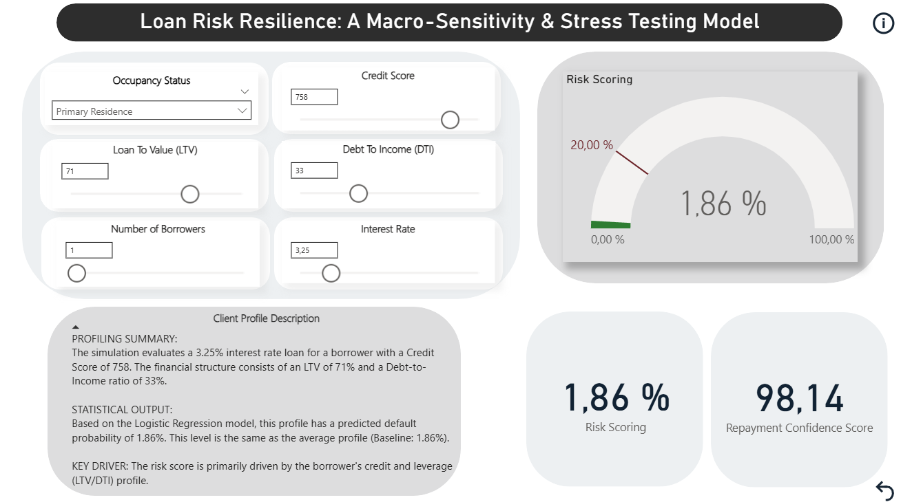
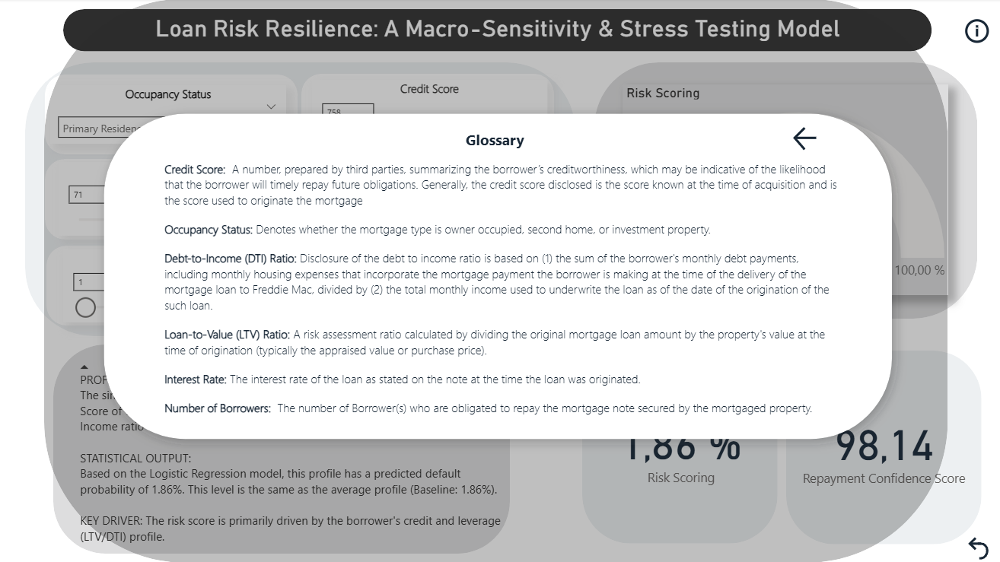

# Loan Risk Resilience: A Macro-Sensitivity \& Stress Testing Model

### A logistic regression approach to identifying the key drivers of mortgage default risk

\---

## Overview

Financial institutions constitute one of the pillars of modern societies. They provide
the framework that enables a smooth transition from short-term resources into long-term
mechanisms through credits and loans — allowing liquidity to reach those who need it in
the present.

This, however, exposes these organizations to an enormous degree of uncertainty, as they
depend on the successful return of the resources they lend. An individual who does not
fulfill their commitments represents a monetary loss that can be exacerbated if this
behavior is replicated by other debtors.

Based on the Single Family Loan-Level Dataset (2020) supplied by Freddie Mac, a multiple
logistic regression was conducted in Python to identify which borrower and loan
characteristics act as catalysts or deterrents of default risk across 50,000 observations.

\---

## Business Context

Information asymmetry is an intrinsic feature of credit markets — financial institutions
do not have complete knowledge of how borrowers will behave in the long term. For
mortgage lenders, understanding which variables drive default risk is not just an academic
exercise: mispricing risk at origination can translate into portfolio losses that compound
over time. This model provides a data-driven baseline to quantify the contribution of each
risk factor to the probability of default at the individual loan level.

\---

## Dataset

* **Source:** Freddie Mac — Single Family Loan-Level Dataset (2020 sample). Retrieved from https://claritydownload.fmapps.freddiemac.com/CRT/#/sflld
* **Raw observations:** 50,000
* **Final sample:** 50,000 (after median imputation for unknown credit scores coded as 9999)
* **Target:** `default` (binary: 1 = defaulted, 0 = did not default)
* **Default rate:** 2.12%

\---

## Methodology

### Feature engineering

|Feature|Type|Rationale|
|-|-|-|
|credit\_score|Raw|Borrower creditworthiness — unknown values (9999) imputed with sample median|
|occupancy\_status\_I|Engineered|Investment property dummy (base: Primary residence)|
|occupancy\_status\_S|Engineered|Secondary residence dummy (base: Primary residence)|
|dti|Raw|Debt-to-income ratio — measures repayment capacity|
|ltv|Raw|Loan-to-value ratio — measures asset position|
|interest\_rate|Raw|Cost of credit — directly affects remaining borrower income|
|num\_borrowers|Raw|Number of co-borrowers — distributes debt burden across income sources|

### Econometric decisions

* **Base category:** Primary residence (occupancy\_status = P) — most frequent category,
provides the most stable baseline for coefficient interpretation
* **Credit score imputation:** Median replacement for 9999-coded unknowns — preserves
observations without introducing mean distortion from extreme values
* **Standard scaling:** Applied before sklearn LogisticRegression — MLE-based iterative
optimizer does not handle variables on different scales well, unlike OLS
* **Average Borrower profile:** Constructed using rounded means of all numeric variables
at primary residence status — yields a baseline default probability of 1.28%

\---

## Results

|Metric|Value|
|-|-|
|McFadden Pseudo R²|0.1010|
|LLR p-value|6.737e−216|
|Observations|50,000|
|Convergence|Yes (9 iterations)|

1. All seven predictors are significant at the 5% level.
2. Interest rate is the leading driver of default risk — each percentage point increase
escalates the odds of default by 124.11% (calculated as (e^0.7828 − 1) × 100).
3. Credit score reduces the odds of default by 1.06% per point
(calculated as (1 − e^−0.0107) × 100).
4. An additional borrower decreases the odds of default by 44.135%
(calculated as (1 − e^−0.5822) × 100).
5. Investment properties emerge as the strongest occupancy-based risk reducer —
reflecting the financial resilience of borrowers who have previously honored obligations.
6. DTI and LTV raise the odds of default by 3.82% and 1.85% per unit increase,
respectively — confirming that weak asset and income positions translate into
financial stress.

\---

## Diagnostic tests

|Test|Statistic|p-value|Conclusion|
|-|-|-|-|
|LLR (Log Likelihood Ratio)|1,019.6|6.737e−216|Model significantly outperforms null|
|VIF (all features)|< 1.26|—|No multicollinearity|

**Note on classical OLS diagnostics:** Autocorrelation, heteroscedasticity, and normality
tests do not apply to logistic regression. Each observation is an independent borrower
(no serial structure). Heteroscedasticity is structural and inherent to the Bernoulli
distribution: Var(y) = p(1−p). Normality is not a MLE assumption — the outcome follows
a Bernoulli distribution, not a normal one.

---

## Model performance

|Metric|Value|
|-|-|
|Confusion matrix — True Negatives|6,886|
|Confusion matrix — False Positives|2,924|
|Confusion matrix — False Negatives|57|
|Confusion matrix — True Positives|133|
|Recall (default class)|0.70|
|Precision (default class)|0.04|

---

## Dashboard

* 

<i>Figure 1: An interactive stress-testing tool initialized at the average borrower profile. 
It allows users to manipulate macroeconomic and individual variables (like Interest Rate and Credit Score) to simulate 
high-risk scenarios and visualize the immediate impact on the Probability of Default (Risk Scoring).
</i>

* 

<i>Figure 2: Comprehensive project glossary providing technical definitions for the key risk 
drivers—such as LTV, DTI, and Credit Score—ensuring transparency in the variables that feed the Logistic Regression engine.
</i>

---

## Limitations

* The model is trained on a 2020 Freddie Mac sample — macroeconomic conditions specific
to that period (pre/post COVID-19 shock) may limit generalizability to other cycles.
* Six predictors capture borrower financial profile but exclude behavioral variables
such as employment history, savings rate, or payment history, which could meaningfully
improve the McFadden R².

\---

## Tech stack

* **Language:** Python 3
* **Libraries:** pandas · numpy · statsmodels · scikit-learn · scipy
* **Output:** CSV with predicted default flags and probability scores, ready for Power BI

\---

## Files

|File|Description|
|-|-|
|`SFLLD\\\\\\\_Logistic\\\\\\\_Regression\\\\\\\_Model.py`|Full pipeline: cleaning, modeling, diagnostics, scaling, export|
|`model\\\\\\\_parameters\\\\\\\_reference.csv`|Beta coefficients, means, and limits for Power BI stress testing|
|`single\\\\\\\_family\\\\\\\_loan\\\\\\\_level\\\\\\\_dataset\\\\\\\_curated\\\\\\\_predictions.csv`|Full dataset with predicted default and probability score|

